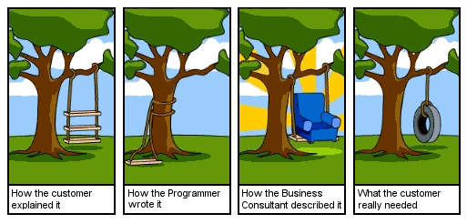
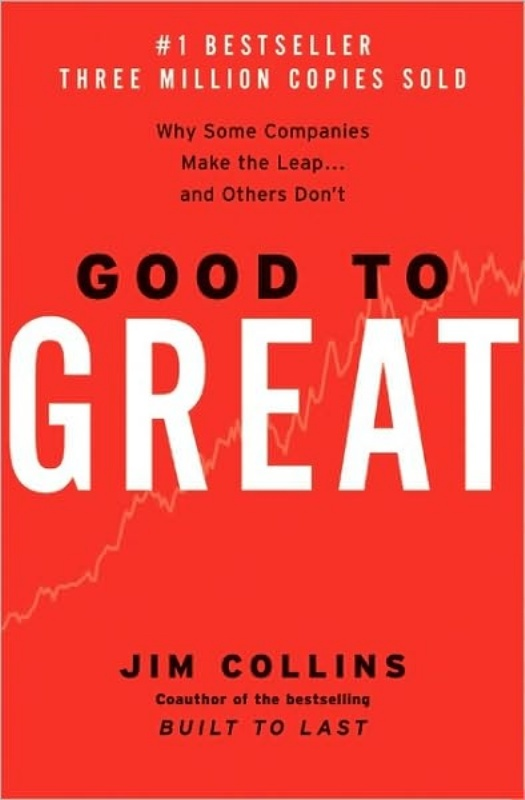

footer: Patrick Rauland - @BFTrick

# One WordPress Site. Double the Flexibility; Hold the Maintenance.

---

# The Story of Steve and John

---

# Steve

^ So you're a business owner and you hear you need a website so that people can find you. And everyone keeps saying how "easy" it is.

^ There's a problem though. And that's that...

---

# You're an Expert at *Your* Business
## Not Websites

^ Do you need a responsive site? Do you need SEO optimization? Do you need a newsletter? How many pages do you need? Don't you want an app? What's the difference between a responsive site and an app anyway?

^ With a lot of companies you're basically shooting in the dark. And this is what happens...

---

---

# The Saga Isn't Over

^ Now we have website maintenance. Do you pay an agency $500 a month to maintain your site? Or do you pay them nothing and assume the responsibility yourself?

^ When I worked at an agency many people opted for updating the website themselves and you know how often things got updated? Approximately *never*. We're *ALL* busy people. With a million things we'd rather be doing for our business.

---

# A Book Recommendation

^ In this book the author, Jim Collins, focuses on companies that were "good" for at least 15 years and then became "great" for at least 15 years after that. Good companies basically did as well as their competitors Great companies destroyed their competition.

^ He developed a lot of interesting theories doing this study. One of which is the hedgehog concept. Which is where you focus on ONE thing to the exclusion of all else. And by doing this one thing better than anyone else you'll become the leader.

^ The reason it's called the hedgehog concept is because no matter how clever, or fast, or pouncy, another animal is he won't be able to beat the hedgehog. No matter what comes at the hedgehog he knows what he's good at. He'll curl up into a ball of spikes until the threat goes away.

^ I realize this story has been going on a while. But I have a point.

---

# If You're Not Already A Web Developer *Don't* Become One

^ You have better things to do with your time.

^ I have two services that are going to make your life a LOT easier.

---

# WPCurve

## Unlimited 30 min jobs for $69 a month.

^ That's $828 ALL YEAR. You can't beat that.

---

> Can you please update WordPress and any plugins?

---

> Can you please add this Facebook Ad conversion pixel to my site?

---

> Can you please delete this page and remove all links to it?

---

> Can you please center this image?

---

> Can you please install my Google Analytics code?

---

> Can you please check to see if there are any comments that need to be moderated?

---

> Can you please change the color of the menu?

---

> Can you please add this image to my sidebar and link it to this page?

---

> Can you please make sure the contact form always CC's this person?

---

# Codeable

## Custom WordPress Tasks

---

# 99% Satisfaction Rating

^ The best thing about Codeable is that they will FIRE you if you write a bad proposal. They will delete it and tell you how to rewrite it to be more specific.

---

> Can you please turn this old raw HTML content into a custom post type on my main site?

---

> Can you please make my theme responsive?

---

> Can you please customize the search so it works better for real estate?

^ Honestly there's so much you can do with these services. Maintenance has become cheap. Now you can spend your time doing the thing you're best at.

---

# Questions?
